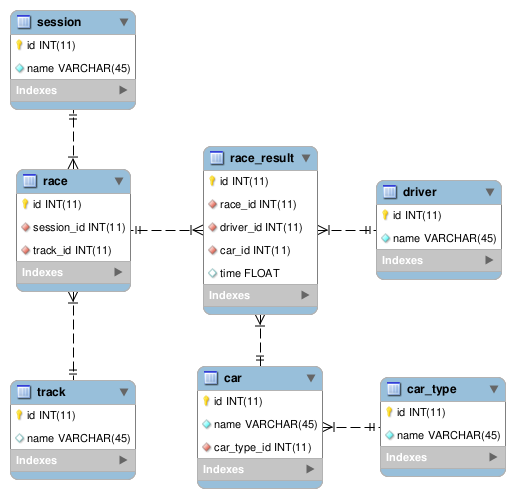

# Cars
Proyecto para entrenamiento.

### Tecnologías
* Maven 3.5 
* Spring Boot 2.0.5
* JPA 2.1
* MySql 8.0 

### Modelo

### Tareas
1. Clonar el repositorio.
2. Crear un nuevo branch partiendo de **master** con el nombre **<yyyymmdd_apellido>**.
3. Importar el proyecto en IDE (Eclipse).
4. Ejecutar el proyecto desde el IDE o ejecutando el comando **mvn spring-boot:run**.
5. Verificar el funcionamiento del servicio **"getAllCars"** mediante el siguiente comando: **wget http://localhost:8080/cars**.
6. Crear servicios de CRUD (controller, entity y repository) sobre la entidad **Track** basándose en CarController y CarRepository.
7. Mapear las entidades que aún no estén mapeadas en el package **com.mercel.cars.model**.
8. Crear el servicio **"getSessionById"** que será invocado mediante **wget http://localhost:8080/sessions/{id}** y debe retornar toda la información disponible de la sesión (carreras, resultados, pilotos y autos).
9. Crear el servicio **"getScoresBySession"** que será invocado mediante **wget http://localhost:8080/sessions/{id}/scores** y debe retornar una lista ordenada con el puntaje acumulado de cada piloto en todas las carreras de la sesión (se asignan 10 puntos para el ganador de cada carrera, 5 para el segundo y 0 para el resto).
10. Enviar el branch creado al repositorio de origen.